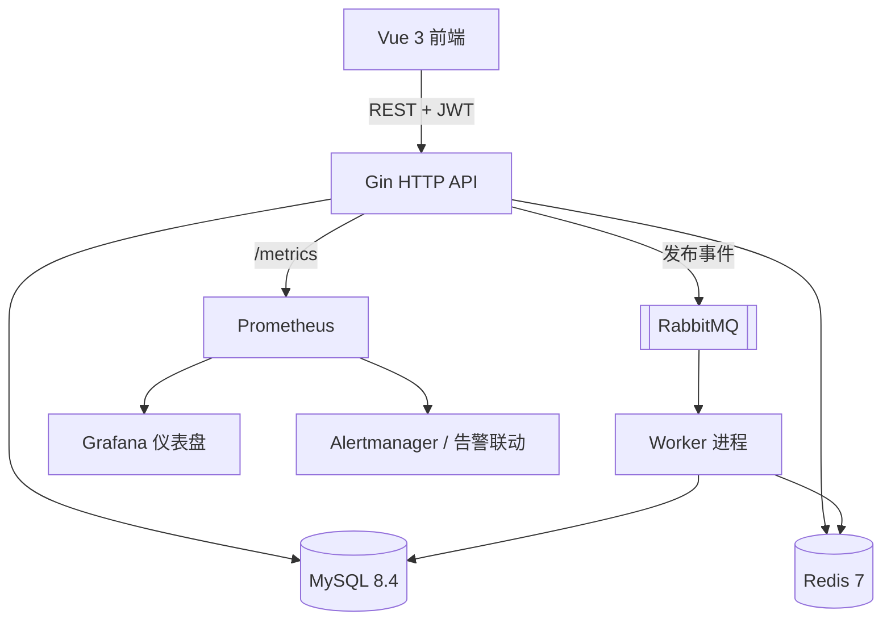
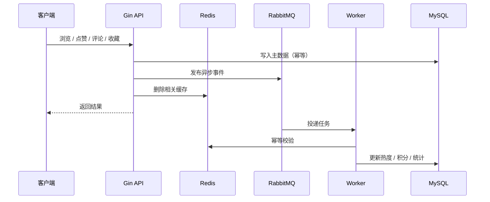

# GoCommunity

一个用 Go + Vue 实现的高并发资源社区平台，覆盖用户认证、资源发布、Feed 分发、互动、积分激励、异步任务与可观测性。

## 简介

GoCommunity 提供一套完整的社区后端实践：REST API 服务负责读写与鉴权，独立 Worker 通过 RabbitMQ 处理浏览、点赞、评论、收藏等异步事件并回写热度与积分。Redis 承担缓存、热榜、限流与消费幂等，MySQL 负责持久化。项目内置 Prometheus / Grafana 配置，可采集接口指标并触发告警，作为排障演练的数据源。

## 功能

- **用户认证**：注册、登录、Access / Refresh 双 Token 续期，登出通过 Token Version 令旧 Token 失效。
- **资源内容**：发布、草稿 / 发布 / 归档状态、封面上传、内容图片上传、分类标签、关键词搜索、详情访问控制。
- **Feed 分发**：最新流、热门流、关注流，关注流使用 `(created_at, id)` 游标分页。
- **互动体系**：点赞、评论、收藏、关注作者。
- **积分体系**：每日签到、发布奖励、互动奖励、积分解锁付费资源、特权兑换。
- **异步任务**：RabbitMQ 发布浏览 / 点赞 / 评论 / 收藏事件，Worker 消费后更新热度与统计；失败按次数重试并进入死信队列。
- **缓存治理**：详情缓存防穿透、TTL 抖动、请求合并，列表 / 热榜 / 关注流 / 积分摘要独立缓存，写入路径主动失效。
- **可观测性**：`/metrics` 指标、Grafana 仪表盘、Prometheus 告警规则、`/healthz` 健康检查、慢请求日志、可选 pprof。
- **前端体验**：Vue 3 + Vite + TypeScript + Pinia + Element Plus，覆盖登录注册、资源列表、详情、发布与个人中心。

## 技术栈

| 分层 | 技术 |
|---|---|
| 后端 | Go 1.25、Gin、GORM、Viper |
| 存储 | MySQL 8.4、Redis 7 |
| 消息 | RabbitMQ（direct exchange） |
| 认证 | JWT、bcrypt、Token Version |
| 前端 | Vue 3、Vite、TypeScript、Pinia、Element Plus、Axios |
| 可观测 | Prometheus、Grafana、pprof |
| 测试 | Go test、miniredis、SQLite、Vitest |
| 部署 | Docker Compose |

## 架构



一次浏览 / 点赞类写操作的异步链路：



## 快速开始

```bash
cp .env.example .env
docker compose up --build
```

Compose 会启动 MySQL、Redis、RabbitMQ、后端 API、Worker、前端、Prometheus 与 Grafana。

| 服务 | 地址 | 默认凭据 |
|---|---|---|
| 前端 | http://localhost:5173 | - |
| 后端 API | http://localhost:8080 | - |
| 健康检查 | http://localhost:8080/healthz | - |
| 指标 | http://localhost:8080/metrics | - |
| Prometheus | http://localhost:9091 | - |
| Grafana | http://localhost:3001 | `admin` / `admin` |
| RabbitMQ 管理台 | http://localhost:15674 | `guest` / `guest` |

后端容器内部监听 `3000`，Compose 映射到宿主机 `8080`。

### 本地开发

后端读取 `backend/config/config.yaml`，可按需调整 DSN、Redis 与 RabbitMQ 地址，或用 `RESOURCE_COMMUNITY_GO_*` 环境变量覆盖。

```bash
cd backend
go mod download
go run .                # API，默认 :8080
go run ./cmd/worker     # Worker
```

```bash
cd frontend
npm ci
npm run dev
```

## 环境变量

常用变量见 `.env.example`：

| 变量 | 说明 |
|---|---|
| `RESOURCE_COMMUNITY_GO_APP_PORT` | API 监听端口 |
| `RESOURCE_COMMUNITY_GO_DATABASE_DSN` | MySQL DSN |
| `RESOURCE_COMMUNITY_GO_REDIS_ADDR` | Redis 地址 |
| `RESOURCE_COMMUNITY_GO_RABBITMQ_URL` | RabbitMQ 连接串 |
| `RESOURCE_COMMUNITY_GO_JWT_SECRET` | JWT 密钥 |
| `RESOURCE_COMMUNITY_GO_UPLOAD_DIR` | 上传目录 |
| `RESOURCE_COMMUNITY_GO_ENABLE_PPROF` | 是否开启 pprof |
| `RESOURCE_COMMUNITY_GO_SLOW_REQUEST_THRESHOLD_MS` | 慢请求阈值 |

## API 概览

| 方法 | 路径 | 说明 |
|---|---|---|
| `GET` | `/healthz` | 健康检查 |
| `GET` | `/metrics` | Prometheus 指标 |
| `POST` | `/api/auth/register` `/api/auth/login` `/api/auth/refresh` | 注册 / 登录 / 续期 |
| `POST` | `/api/auth/logout` | 登出（需认证） |
| `GET` | `/api/articles` | 资源列表，支持 `page`、`pageSize`、`sort`、`keyword`、`tag` |
| `GET` | `/api/articles/hot` | 热门资源 |
| `GET` | `/api/articles/:id` | 资源详情（可选认证，用于判断付费内容是否已解锁） |
| `POST` | `/api/articles` | 发布资源（需认证） |
| `POST` / `DELETE` | `/api/articles/:id/like` | 点赞 / 取消点赞 |
| `GET` / `POST` | `/api/articles/:id/comments` | 评论列表 / 创建评论 |
| `POST` / `DELETE` | `/api/articles/:id/favorite` | 收藏 / 取消收藏 |
| `POST` / `DELETE` | `/api/authors/:id/follow` | 关注 / 取消关注作者 |
| `GET` | `/api/me/following/articles` | 关注流 |
| `GET` / `POST` | `/api/me/points` `/api/me/points/records` `/api/me/check-in` `/api/me/points/redeem` | 积分摘要 / 流水 / 签到 / 兑换 |
| `POST` | `/api/articles/:id/unlock` | 积分解锁资源 |
| `POST` | `/api/uploads/cover` `/api/uploads/content-images` | 上传封面 / 内容图片 |

## 核心实现

- **详情缓存读路径**：`Redis -> MySQL -> 回填 Redis`。不存在的资源写入短 TTL 空值防穿透；`JitterTTL` 在基础 TTL 上增加最多 20% 抖动；回源使用进程内请求合并，热点 Key 失效时同一资源只放行一次查询。
- **热榜**：基于 Redis ZSet，初始分 `50 + created_at/86400`，互动权重为浏览 `+1`、点赞 `+8`、评论 `+12`、收藏 `+10`，由 Worker 消费后更新。
- **异步任务**：事件类型为 `article.published`、`article.viewed`、`article.liked`、`comment.created`、`comment.deleted`、`favorite.created`、`favorite.deleted`。消费用 Redis 幂等去重，失败按 `x-retry-count` 最多重试 3 次，超限投递到 `<queue>.dlq` 并写入 `x-failure-reason`。
- **安全与限流**：密码 bcrypt 哈希，JWT 携带 Token Version；Redis 固定窗口限流覆盖注册、登录、发布、评论与签到，超限返回 `429`。
- **可观测**：暴露 `resource_community_http_requests_total` 与 `resource_community_http_request_duration_seconds`，`path` 标签使用 Gin 路由模板（如 `/api/articles/:id`）避免高基数。告警覆盖后端不可抓取、1 分钟 5xx 错误率超 5%、整体 P95 超 500ms。

## 项目结构

```text
GoCommunity/
├── backend/
│   ├── main.go              # API 进程入口
│   ├── cmd/worker/          # Worker 进程入口
│   ├── config/              # 配置加载、MySQL / Redis / RabbitMQ 初始化与迁移
│   ├── internal/
│   │   ├── app/             # 路由、鉴权、限流、指标与观测中间件
│   │   ├── auth/            # 认证
│   │   ├── article/         # 资源、Feed、热榜、详情缓存
│   │   ├── asyncjob/        # 异步任务类型与 RabbitMQ 发布器
│   │   ├── cachekey/        # Redis Key 与 TTL 策略
│   │   ├── comment/         # 评论
│   │   ├── favorite/        # 收藏
│   │   ├── media/           # 封面与内容图片上传
│   │   ├── points/          # 积分、解锁、签到、兑换
│   │   ├── social/          # 关注关系
│   │   └── worker/          # 消费、重试、死信与幂等
│   └── utils/               # JWT 与密码工具
├── frontend/                # Vue 3 前端
├── observability/           # Prometheus 抓取与告警规则、Grafana 仪表盘
├── docs/                    # 设计、压测与证据文档
├── scripts/                 # 可观测性演练脚本
├── .github/workflows/       # CI
└── docker-compose.yml
```

## 测试与 CI

```bash
cd backend && go test ./...

cd frontend && npm ci && npm run test && npm run build
```

CI（`.github/workflows/test.yml`）执行后端测试、前端构建、`docker compose config` 校验，以及前后端镜像构建检查。

可观测性演练脚本位于 `scripts/observability_drill.sh`，配套测试为 `scripts/test_observability_drill.sh`。

## 文档

- `docs/benchmark.md`：列表接口 wrk 压测口径与结果。
- `docs/evidence/`：压测证据记录。
- `observability/observability.md`：指标、PromQL、告警规则与演练说明。
- `docs/interview-qa.md`、`docs/Learning.md`：实现问答与学习笔记。
